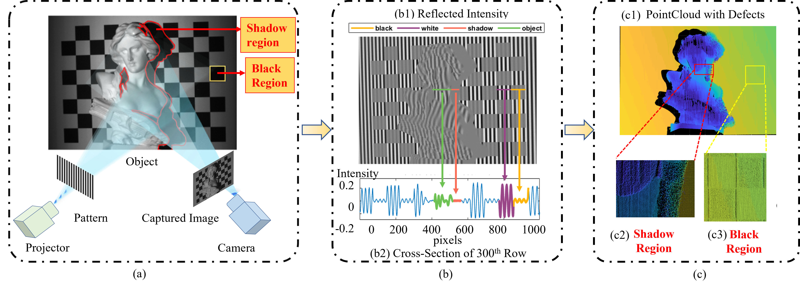
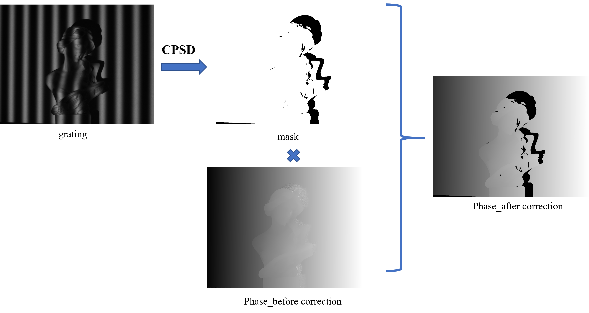

# CPSD for phase correction in shadow area of measured objects and black area in calibration palne

<div align="center">

<h1> Measurement_under review

<div>
    <p> <b>Tsinghua SIGS</b> </p>
</div>



</div>
<div style="text-align: justify;">
## Introduction

- Fringe projection profilometry (FPP) faces challenges in measuring unsatisfactory intensity modulation areas, especially shadow and black areas, causing pseudo phases and obvious nonlinear calibration error in 3D measurement. To address these issues oncurrently, we proposed a cyclic phase-shifts difference (CPSD) module based on phase-shifting gratings. CPSD uses doublelayer circulation to retain the pixels with higher light intensity and finally create a mask that removes black and shadow areas. Removing the necessity for further post-processing or projection in phase adjustment, we achieved the global phase accuracy enhancement and high-precision 3D point clouds without pseudo points. The method’s efficacy was proven through experiments onthree calibration planes, achieving a significant reduction in mean absolute error (MAE) and standard deviation (STD) in plane reconstruction (up to 50.9% and 56.1% respectively). We believe CPSD has potential for wide application across various FPPrelated fields.
</div>
  

  
## Code
  ```matlab
  - run the test_run.m


  %%code of CPC and CPSD
  %%See the 'function' file for subfunctions
  %%The test data is in folder <test_data_calibration_plane> and <test_data_object>

```

  


## Updates
- [03/2024] We will continue to update the related research. Stay tuned!


## Agreement

Authors reserves the right to terminate your access to the Dataset at any time.

## More informarion
Details about the code and dataset can be found in this paper. 

## Contact
- Yiming Li (liyiming21@mails.tsinghua.edu.cn)

